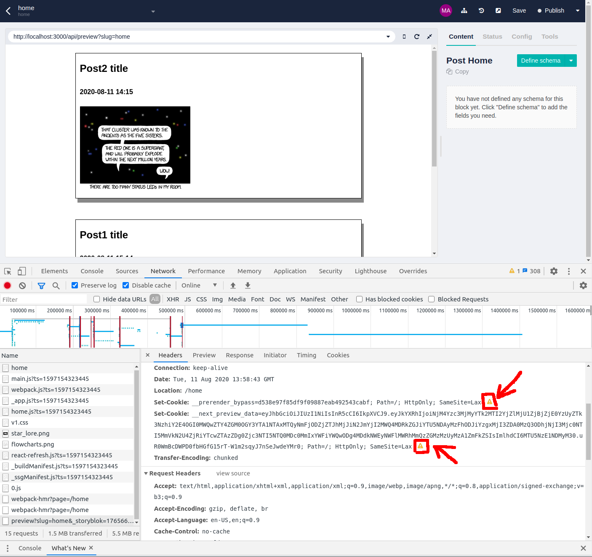

# Demo Next Storyblok

> This project is temporary and will be removed as soon as the problem will be solved.

This micro-project shows a challenge we've encountered while integrating NextJs' Preview Mode https://nextjs.org/docs/advanced-features/preview-mode with the Storyblok's Visual Editor https://www.storyblok.com/docs/guide/essentials/visual-editor.

To build this project, I started from Vercel's guide: https://vercel.com/guides/deploying-next-and-storyblok-with-vercel. I've customized it enabling the preview mode plus some minor modifications.

## The Challenge

To work correctly, the Next's Preview Mode needs to set two special cookies: `__prerender_bypass` and `__next_preview_data`.

Only when we try to visualize the page inside the Storyblok's Visual Editor, the cookies cannot be set due to the error:

> "This Set-Cookie was blocked because it had the "SameSite=Lax" attribute but came from a cross-site response which was not the response to a top-level navigation".

